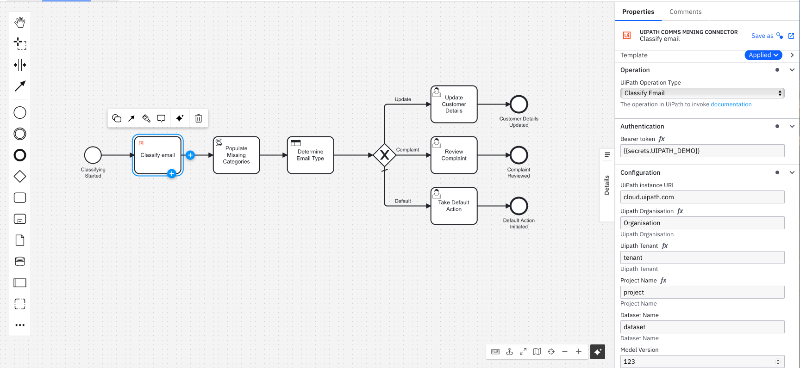

# UiPath Comms Mining Connector Template

This project contains a custom Camunda 8 Connector template that provides access to UiPath operations.

# How to install the connector

## With Web Modeller
The following instructions detail how to install the connector template when using the Web Modeller, which can be used in a SaaS or Self-Managed environment: https://docs.camunda.io/docs/components/connectors/manage-connector-templates/#importing-existing-connector-templates

## Within Desktop Modeller
The following instructions detail how to install the connector template when using the Desktop Modeller, which can be used in a SaaS or Self-Managed environment:: https://docs.camunda.io/docs/components/modeler/desktop-modeler/element-templates/configuring-templates/

# How to use the Connector in a model
First the Connector template needs to be uploaded to the project. Then, it can be used within a process model, for example:



# Supported Operations
Links below take you to the UiPath documentation for the specific API
1. [Classify Email](https://docs.uipath.com/communications-mining/automation-cloud/latest/developer-guide/predictions#get-predictions-for-a-pinned-model-for-raw-emails)

# Prerequisites
1. You will need to have set up [UiPath Communications Mining](https://docs.uipath.com/communications-mining/automation-cloud/latest/user-guide/introduction-to-uipath-communication-mining) for your UiPath service.
2. You will need the following pieces of data for the connector, which may be stored as secrets;
- `Bearer Token`
- `UiPath Instance URL`
- `UiPath Organisation`
- `UiPath Tenant`
- `Project Name`
- `Dataset Name`
- `Model Version`

## Passing in the email to be classified by UiPath
The email to be analysed should be passed into the connector properties Input field in the JSON format shown below. The `Date` field should be provided in the format shown.

```json
    {
      "raw_email": {
        "headers": {
          "parsed": {
            "Date": "Wed, 21 Jun 2023 09:00:00 +0000",
            "Message-ID": "Message ID i.e 1a2b3c4d-1234-1234-1234-123456678",
            "From": "sender@email.com",
            "To": "receiver@email.com",
            "Subject": "Email Subject"
          }
        },
        "body": {
          "plain": "The bank details are not correct on my account, they should be 03-03-03 82828282 Regards, John Doe"
        }
      }
    }
```

## Response you get from the request
```json
{
    "predictions": [
        [
            {
                "name": [
                    "Admin"
                ],
                "probability": 0.9957658052444458,
                "sentiment": 0.9690028429031372
            },
            {
                "name": [
                    "Admin",
                    "Bank Details Update"
                ],
                "probability": 0.9957658052444458,
                "sentiment": 0.9995757937431335
            }
        ]
    ],
    "model": {
        "version": 123,
        "time": "2024-04-02T15:46:19.035000Z"
    },
    "entities": [
        [
            {
                "id": "553f50b37c92c1f5",
                "name": "bank-sort-code",
                "spans": [
                    {
                        "content_part": "body",
                        "message_index": 0,
                        "utf16_byte_start": 126,
                        "utf16_byte_end": 142,
                        "char_start": 63,
                        "char_end": 71
                    }
                ],
                "kind": "bank-sort-code",
                "formatted_value": "03-03-03",
                "probability": 0.9999817609786987,
                "capture_ids": [],
                "span": {
                    "content_part": "body",
                    "message_index": 0,
                    "utf16_byte_start": 126,
                    "utf16_byte_end": 142,
                    "char_start": 63,
                    "char_end": 71
                }
            },
            {
                "id": "74dc732573f3fd70",
                "name": "bank-account",
                "spans": [
                    {
                        "content_part": "body",
                        "message_index": 0,
                        "utf16_byte_start": 144,
                        "utf16_byte_end": 160,
                        "char_start": 72,
                        "char_end": 80
                    }
                ],
                "kind": "bank-account",
                "formatted_value": "82828282",
                "probability": 0.9999860525131226,
                "capture_ids": [],
                "span": {
                    "content_part": "body",
                    "message_index": 0,
                    "utf16_byte_start": 144,
                    "utf16_byte_end": 160,
                    "char_start": 72,
                    "char_end": 80
                }
            }
        ]
    ],
    "sentiment": [
        {
            "total": 0.9767008423805237
        }
    ],
    "label_properties": [
        [
            {
                "property_id": "0000000000000001",
                "property_name": "tone",
                "value": -1.2095236778259277
            },
            {
                "property_id": "0000000000000002",
                "property_name": "quality_of_service",
                "value": -0.14310212433338165
            }
        ]
    ],
    "status": "ok"
}
```
# Element Template
The element template can be found in the `element-templates/uipath_comms_mining_connector.json` file.

# Contributing
To contribute to this connector, see the [CONTRIBUTING](CONTRIBUTING.md) file.

# Licence
Any materials for this connector contributed by Camunda (e.g. JSON config file format) are covered by
[Camunda's Documentation Licence](https://github.com/camunda/camunda-docs/blob/main/LICENSE.txt).
Overall this Connector is covered by the [Creative Commons License](LICENSE) included in this repo.
